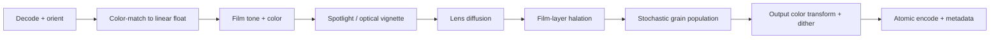
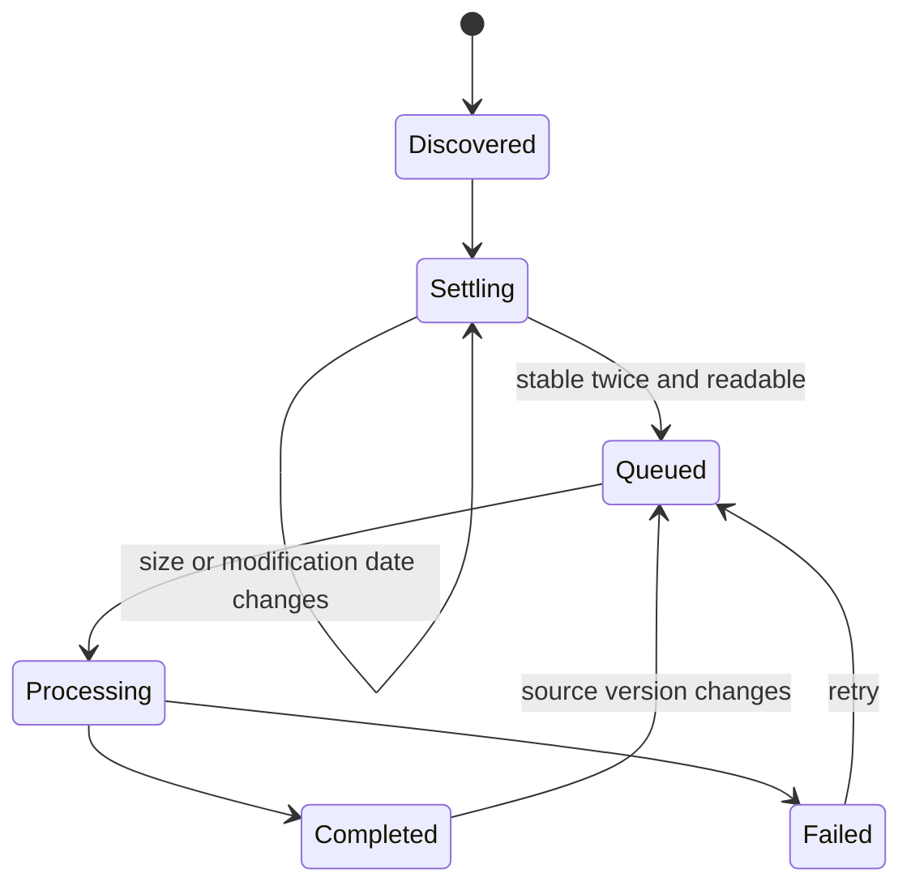

# Filmify: Product and Engineering Blueprint

Status: product definition  
Date: 2026-07-21  
Working title: **Filmify**

## The product in one sentence

Filmify is a small, native Mac utility that gives digital images convincing optical and photochemical texture: drop in images or point it at a folder, choose a film recipe, and receive finished copies with lens diffusion, restrained halation, tone-responsive grain, and optical light falloff.

The promise is not “a lot of effects.” It is: **four closely related effects, done unusually well, with almost no ceremony.**

## Product principles

1. **Mac first, not merely Mac-compatible.** The app has a real menu bar, Dock behavior, drag and drop, inspectors, keyboard commands, Quick Look-friendly output, sandboxed folder access, and excellent accessibility.
2. **Immediate by default.** After a one-time output-folder grant, a drop starts processing with the active recipe. There is no import screen, catalog, project file, or per-batch confirmation.
3. **Photographic rather than decorative.** Grain is signal-dependent and spatially correlated. Diffusion scatters light while retaining apparent acuity. Halation redistributes exposure through the film layers. Vignetting changes exposure rather than painting translucent black over the image.
4. **Simple on the surface, deep when invited.** Most people choose a recipe. The trailing adjustment panel exposes the underlying four effects when invited.
5. **Quietly trustworthy.** Originals are never modified, the same inputs and settings reproduce the same output, color profiles and useful metadata survive, and failed jobs explain themselves.
6. **No fake precision.** Built-in recipes remain descriptive. Named color stocks must come from a disclosed measured or spectral negative-to-print model, identify the simulated print pairing, and be presented as simulations rather than manufacturer-endorsed profiles.

## Scope

### Version 1 includes

- A regular macOS app with a Dock icon and standard menu bar.
- Dragging one or more images onto the app window or its Dock icon.
- Watched-folder automation in Settings with a separately selected output folder.
- A deterministic GPU-accelerated still-image pipeline.
- Lens diffusion, halation, tone-responsive grain, and subtle spotlight/vignette light shaping.
- Three built-in recipes, user-created recipes, and per-effect controls.
- JPEG, HEIC, PNG, and TIFF input and output.
- Batch progress, cancellation, collision-safe naming, and a small recent-activity list.
- A menu-bar status item while folder watching is enabled.
- Optional Launch at Login.
- Fully local processing; no account, cloud, analytics SDK, or network dependency.

### Deliberately not in version 1

- A photo library, asset catalog, nondestructive edit history, layers, masks, color grading, or crop tools.
- Video, Live Photos, animated images, or image sequences.
- Claims that named stock simulations are manufacturer profiles or exact substitutes for a complete capture, development, scan, and print workflow.
- RAW development. A RAW file needs interpretive demosaicing and camera-specific controls, which would quietly turn Filmify into a RAW editor. Add it later only as an explicit workflow.
- Full HDR/gain-map output. Version 1 should detect HDR or gain-map input and offer a clearly labeled SDR conversion instead of silently invalidating HDR metadata.
- A privileged daemon. Watching operates while Filmify is running; Launch at Login is the transparent way to make it persistent.

## The interaction model

The app has two foreground modes: a compact **Instant** workspace and a larger **Edit** workspace. The recipe picker follows the work: Instant presents the active recipe name as a dropdown in its processing explanation, while Edit places a compact icon dropdown at the trailing edge of the Adjustments header. The system toolbar keeps only the intrinsic-size mode picker at trailing. Watched-folder automation is configured in Settings and reports through the menu-bar item; it is not a third workspace competing with the photograph.

```text
┌──────────────────────────────────────────────────────────┐
│                                     [ Instant ] [ Edit ]  │
├──────────────────────────────────────────────────────────┤
│                                                          │
│                   ↓ Drop images here                     │
│        Process immediately with [ Classic 35 ⌄ ]         │
│             JPEG · HEIC · PNG · TIFF                     │
│                                                          │
│        or choose images…        Output: Filmify Exports  │
│                                                          │
├──────────────────────────────────────────────────────────┤
│  ✓ portrait-02.jpg                         Reveal in Finder│
└──────────────────────────────────────────────────────────┘
```

Edit always includes a stable trailing Adjustments panel; Instant never includes it. There is no show/hide button or transient inspector lifecycle. Keeping the panel inside the content hierarchy avoids AppKit constraint-cycle crashes when modes and window sizes change rapidly:

```text
┌──────────────────────────────────────┬───────────────────┐
│                                      │ Adjustments  [⌄]  │
│          image / drop content        │                   │
│                                      │ Vignette    [on]  │
│                                      │ Amount    ━●━━━━  │
│                                      │ Focus    ━━━●━━  │
│                                      │                   │
│                                      │ Diffusion  [on]   │
│                                      │ Amount    ━●━━━━  │
│                                      │ Bloom     ━━●━━━  │
│                                      │                   │
│                                      │ Halation   [on]   │
│                                      │ Amount    ━●━━━━  │
│                                      │ Spill     ━━●━━━  │
│                                      │                   │
│                                      │ Grain       [on]  │
│                                      │ Amount    ━●━━━━  │
│                                      │ Size      ━━●━━━  │
│                                      │          Advanced›│
└──────────────────────────────────────┴───────────────────┘
```

### Instant mode

There are three equivalent entry points:

- Drop images into the main window.
- Drop images onto Filmify in the Dock.
- Choose **File > Process Images…** (`⌘O`).

A drop starts immediately with the active recipe. Instant mode deliberately shows no image preview and no adjustment inspector: it is a compact target plus current recipe, destination, and latest job status. If the app is launched by a Dock-icon drop, it may show this compact progress window but must not interpose a setup dialog.

On the first drop, Filmify asks once: **Choose Instant Output Folder**. It stores a security-scoped bookmark and uses that destination for future drops, with the name `Original — Filmify.ext`. Collisions add ` 2`, ` 3`, and so on; no original or previous output is overwritten. This one-time grant is necessary because sandbox access to a dropped file does not automatically authorize writes to its parent directory.

Settings may offer **Beside Original** only after the user has explicitly authorized the relevant parent folder. It must not imply that a file-level drag grants that permission. A direct-download, non-sandboxed edition could behave differently, but version 1 should keep one sandbox-compatible file model.

### Edit mode

Edit mode is the deliberate working surface. Opening or dropping one image loads it without exporting. The workspace provides a live recipe preview, a trailing adjustment inspector, before/after comparison, Fit and percentage zoom, trackpad magnification, scroll-to-pan behavior, recipe save/update/delete, and an explicit Export command. Switching from Instant animates the window to an editing size; switching back restores the compact instant-processing footprint.

### Watched-folder settings

The first setup has two explicit rows:

- **Incoming:** Choose Folder…
- **Finished:** Choose Folder…

Then one clear action: **Start Watching** / **Pause Watching**.

The output folder must not equal the incoming folder. If it is nested inside the incoming tree, Filmify either rejects the arrangement or explicitly excludes that subtree; rejecting it in version 1 is easier to explain and harder to misconfigure.

Useful secondary controls live below a disclosure labeled Options:

- Include subfolders (off by default)
- Keep subfolder structure (on when recursive watching is enabled)
- Launch Filmify at login (off by default)
- Notify when a batch finishes (on only when Filmify is not frontmost)

Watching continues when all Filmify windows are closed, because closing a Mac window is not quitting the app. A menu-bar item appears while watching and shows **Watching**, **Paused**, **Processing n**, or **Needs Attention**. It offers Pause/Resume, Open Filmify, Reveal Incoming Folder, and Quit.

### Adjustments

The primary UI exposes only:

- Recipe
- Film Tone on/off
- Vignette on/off
- Lens Blur on/off
- Diffusion on/off
- Halation on/off
- Grain on/off

The inspector exposes Amount and one defining control per effect. An Advanced disclosure exposes the less common parameters. Filmify ships with only three distinct starting points—Clean 120, Classic 35, and Soft 16. Save New Recipe… gives the working recipe a name; the Recipe Manager renames and deletes user recipes. Built-ins are immutable and always recoverable.

All five optical Amount controls use a normalized `0.0–1.0` scale without effect-specific units. The renderer maps that common scale onto each effect’s physical or perceptual response. Existing recipes were recalculated so normalization changes their displayed numbers without changing their rendered appearance. Above the former Diffusion and Halation ceiling, the upper half progressively adds a second optical pass. Grain `0.25` is the calibrated Classic 35 amount, while `1.0` reaches four times that response.

### Effect-module pattern

Each effect follows the same compact hierarchy in pipeline order:

1. Header: effect icon and name, enable/bypass control, contextual help, and Reset when modified.
2. Primary row: Amount slider with a directly editable numeric value.
3. Character row: the one secondary control most likely to matter.
4. Advanced disclosure: two or three specialist controls and, where useful, a normalized two-dimensional focus point.

| Effect | Primary | Character | Advanced |
|---|---|---|---|
| Film Tone | Color Stock, Stock Amount, Exposure | Contrast | Saturation, Vibrance, Warmth |
| Spotlight/Vignette | Amount | Focus | Pop, Bias, roundness, center |
| Lens Blur | Amount | Falloff | Character, RGB separation, asymmetry, direction, focus center |
| Lens Diffusion | Amount | Bloom | Veil/Fog, Source Bias, warmth, focus center |
| Halation | Amount | Spill Radius | Tail, Color Shift, Saturation, green leakage |
| Grain | Amount | Particle Size | Acutance/Crispness, size variation, chroma, tonal response, seed |

This preserves the successful “one amount plus three character controls” pattern used by strong film-emulation tools without reproducing their oversized rotary controls. Linear native sliders, editable values, arrow-key adjustment, double-click Reset, and sensible units are faster and more precise on a Mac. A restrained per-effect accent may appear in the icon and slider fill, but the inspector remains a system surface rather than four custom dashboards.

Source Bias is displayed like a threshold but implemented as a wide, soft knee. It changes which exposure range contributes most strongly to diffusion without cutting a binary highlight mask. Focus centers are stored as normalized image coordinates so they remain valid across output resolutions and saved recipes.

The Edit preview supports:

- **Fit** and **100%**. Grain judgments should gently prompt the user toward 100% because a fit-to-window preview can hide or alias fine structure.
- Press-and-hold **Original** in the toolbar, plus `\` as a before/after keyboard shortcut.
- A fast proxy while a slider is moving, followed by an exact idle render using the same kernel and seed as export.

## Visual direction: “Mac-assed,” not concept-art glass

The visual identity should come from native hierarchy, excellent spacing, and the photograph itself—not layers of translucent decoration.

- Build with the current SDK and standard SwiftUI/AppKit toolbars, inspectors, menus, sheets, and controls so the system supplies Liquid Glass where it belongs.
- Let glass occupy the functional layer: toolbar controls, active transient controls, popovers, and the inspector boundary. Use a calm standard material or the image itself in the content layer.
- Use one restrained accent color: a warm red-orange sampled from halation. Do not tint every control.
- Hide the window title visually if it improves the composition, but retain normal traffic-light placement, window dragging, resizing, full screen, and Window menu behavior.
- Prefer SF Symbols for commands. Custom symbols are justified only for the recipe/film identity and must match SF Symbol metrics.
- Motion is short and functional: a drop target breathes once, the completed thumbnail resolves from soft to sharp, and the progress ring advances. All effects respect Reduce Motion and Reduce Transparency.
- Instant targets roughly 700 × 400 points so its three toolbar groups never collapse. Edit targets roughly 1080 × 720 points, including a 280–360-point trailing inspector, and remains user-resizable.

This follows Apple’s current guidance: Liquid Glass is intended for controls and navigation, not as decoration throughout the content layer, and standard framework components adapt automatically to accessibility appearance settings. See [Adopting Liquid Glass](https://developer.apple.com/documentation/TechnologyOverviews/adopting-liquid-glass) and [Materials in the Human Interface Guidelines](https://developer.apple.com/design/human-interface-guidelines/materials).

### Icon direction

Avoid the camera-aperture cliché. The mark should be a single glass droplet whose interior contains a sparse field of irregular silver grains, with a hairline warm-red halo on one edge. In Icon Composer, separate it into four meaningful layers:

1. quiet dark backing field;
2. translucent droplet body;
3. irregular grain constellation;
4. red-orange halation rim and one small specular highlight.

It must remain recognizable at 16 points as “the droplet,” even when the grain disappears. Create light, dark, clear, and tinted appearances from the same geometry.

## Built-in recipes

The built-in Recipes describe useful photographic results rather than pretend to be a branded stock catalog. Film Tone separately offers a compact selection of disclosed spectral negative-to-print simulations. These stock choices are ingredients that can be saved into any Recipe, not additional top-level Recipes.

| Recipe | Intended character | Grain | Diffusion | Halation | Vignette |
|---|---|---:|---:|---:|---:|
| Clean 120 | Fine, restrained, medium-format feel | Very fine | Trace | Trace | 0.10 stop |
| Classic 35 | General-purpose default | Medium | Low | Low-medium | 0.20 stop |
| Soft 16 | Pronounced small-format texture | Coarse, clustered | Medium | Medium | 0.30 stop |

**Classic 35** is the default. The three choices deliberately span restrained medium format, the general-purpose baseline, and expressive small format without presenting a stock-catalog wall.

Recipe data is versioned `Codable` JSON stored in Application Support. A recipe contains a virtual film format, grain parameters and tonal response curve, lens-diffusion parameters, halation parameters, light-shaping parameters, and a recipe-schema version. User recipes never alter shipped recipe files.

## The image model

### Why a normal noise overlay is wrong

Photographic grain is a fluctuation in developed density, and its magnitude changes with density and exposure. Kodak’s film data sheets plot diffuse RMS granularity against density separately for the red, green, and blue records; they also note that perceived grain depends on scene content, color, density, exposure, processing, and transfer. See the [Kodak VISION3 50D technical data](https://www.kodak.com/content/products-brochures/Film/VISION3-50D-Color-Negative-Film-7203-TECHNICAL-DATA.pdf). A flat noise image blended over gamma-encoded RGB cannot reproduce that behavior.

### Working representation

1. Decode with Image I/O, apply EXIF orientation, and retain the source properties and ICC profile.
2. Convert through Core Image into a floating-point, scene-linear, wide-gamut working space. Start with extended-linear ITU-R BT.2020 and validate conversions against sRGB, Display P3, Adobe RGB, and ProPhoto RGB fixtures.
3. Run all physical-light operations in linear light. Use logarithmic density only for the emulsion/grain stage.
4. Render back through the selected output profile and encoder. Do not disable color management for speed; correctness is the point of the app.

Core Image already provides a lazy image graph, Metal-backed rendering, tiling, and automatic input/working/output color conversion through a reusable `CIContext`. Image I/O supplies efficient format decoding/encoding and metadata access. See Apple’s [CIContext](https://developer.apple.com/documentation/coreimage/cicontext) and [Image I/O](https://developer.apple.com/documentation/imageio) documentation.

### Pipeline order



Film tone first establishes exposure, contrast, and color balance in a scene-linear working space. Light shaping then precedes the image-forming effects because it changes the exposure entering the optical/film model. Lens diffusion comes before halation: a physical diffusion filter sits in the optical path, and its scattered light subsequently reaches the emulsion and can halate. Halation then redistributes exposure within the film structure. Grain is the stochastic density record of the resulting exposure.

The fixed, acquisition-faithful order is therefore **film tone → vignette → lens blur → lens diffusion → halation → grain**. Filmify should not expose arbitrary effect reordering; that adds editor-like complexity and makes recipes harder to calibrate.

### Lens blur and aberration

Lens Blur simulates field-dependent softness rather than applying a uniform blur. The optical center remains comparatively sharp while edge blur grows through a smooth falloff. Its perceptual-space aperture convolution keeps defocused shapes firmer and prevents the effect from becoming another form of highlight diffusion. Character introduces restrained tangential smear and low-frequency irregularity; asymmetry and direction mimic a decentered vintage lens. RGB Separation produces softly defocused, prismatic color ghosts instead of hard chromatic-aberration outlines. The 0.25 amount is the natural starting point, while the upper range is deliberately available for overcooked vintage-lens effects. These effects share a movable normalized focus center and remain ahead of diffusion and halation in the optical pipeline.

Film Tone should avoid generic RGB adjustment math. Exposure operates on scene-linear luminance through a bounded photographic density family that fixes black and white, lifts deep tones decisively, and progressively reduces gain through the mids and highlights. The +1 EV response is calibrated against a same-source Lightroom reference rather than a nominal RGB multiplier. Raising exposure also contracts perceptual chroma progressively through the raised mids and shoulder, reproducing the loss of dye separation near white and preventing saturated channels from clipping early. Contrast remains a separate stops-based S-curve around 18% gray. Saturation, Vibrance, and Warmth operate in a perceptual color model derived from the linear Rec.2020 working space. Vibrance preferentially expands low-chroma colors while strongly excluding skin-like hues and easing off saturated colors and bright highlights. Warmth favors a Kodak Gold-like yellow-gold density through the midtones and highlights while retaining cleaner, less-red shadows. Chroma is gently compressed back toward the valid gamut rather than channel-clipped.

The initial Color Stock set contains seven 33³ spectral negative-to-print cubes selected from ComfyUI-Darkroom: Portra 160 and 400 on Endura Premier, Gold 200 on Endura Premier, Ektar 100 on Endura Premier, Pro 400H on Crystal Archive Maxima, Superia Reala on Crystal Archive Pro PDII, and Vision3 250D on 2383. Velvia was removed as too aggressive for this compact set, and Vision3 500T was consolidated into 250D because their normalized results were not meaningfully distinguishable in Filmify. The cubes expect display-referred sRGB, so the renderer explicitly bridges from Filmify's extended-linear Rec.2020 working space into gamut-compressed sRGB for lookup and back to linear Rec.2020 afterward. Because the cubes contain full negative-to-print density curves, Filmify retains only 20% of their luminance change while preserving the chromatic response; Film Tone's dedicated controls remain responsible for contrast and exposure. Stock Amount defaults to 1.0 for the intended look and extends to 2.0 by extrapolating the treatment for deliberate overcooking. Zero amount is exactly neutral. Source revision and MIT attribution ship in the application bundle.

### Grain

The leading version-one candidate is the continuous stochastic model described by Newson, Faraj, Delon, and Galerne in [Realistic Film Grain Rendering](https://www.ipol.im/pub/art/2017/192/). It models an emulsion as an inhomogeneous Boolean field: Poisson-distributed grain centers carry fixed or log-normally distributed radii, overlapping grains form natural clumps, and Monte Carlo filtering renders the continuous population at the requested output resolution.

For a target local coverage `u`, the grain-population density is chosen so the expected rendered value reproduces `u`:

```text
λ(y) = -log(1 - u(y)) / (π · E[r²])
```

Where:

- `u(y)` is derived from a recipe-specific exposure/density response, not directly from gamma-encoded RGB. Brightness changes the developed grain population density; it does not make each grain larger within the image.
- `r` follows a recipe-specific physical particle-size distribution. Stock speed, format, and processing may change that distribution between recipes.
- The field is generated in virtual film coordinates. Particle size is stored in micrometers and mapped using the chosen virtual gate width (for example 36 mm for 35 mm still film), so a 6000-pixel scan and a 3000-pixel export depict the same physical texture after appropriate resampling.
- The random seed is derived from a stable file fingerprint plus recipe seed. Preview and export therefore match. A **New Grain Pattern** command changes the recipe seed explicitly.
- Monochrome recipes can use one silver-grain population. Color recipes use three differently scaled dye-record populations with controlled correlation: a dominant shared component keeps the texture photographic, while weaker independent components prevent perfectly monochrome grain without producing digital RGB confetti.
- The renderer operates on floating-point density/coverage values and preserves the expected local tone. It must not inherit an 8-bit lookup table or YUV conversion from a research wrapper.

Implement the model independently as a custom tiled Metal compute stage. Use deterministic cell hashing so any tile can regenerate the same nearby Poisson population without storing every grain. Start with the paper's pixel-wise method; benchmark a grain-wise method for coarse recipes. Interactive previews may use fewer Monte Carlo samples or a spectrum-matched proxy, but a settled 100% preview and export must use the same physical model and seed. The renderer remains protocol-based so a calibrated fallback can ship if the exact model misses performance budgets on the oldest supported GPU.

Inspector controls:

- Amount
- Particle Size
- Soft ↔ Crisp
- Advanced: acutance, size variation, shadow/midtone/highlight response, chroma, virtual format, seed

### Lens diffusion

Lens diffusion is optical scatter, not defocus, skin detection, or a Gaussian blur over the completed image. A useful model has two normalized point-spread components:

```text
I′ = (1 - a - b) · I + a · (Kdetail * I) + b · (Kbloom * I)
```

- `Kdetail` is compact and slightly reduces fine-detail contrast while preserving apparent edge acuity.
- `Kbloom` has a wider, long-tailed profile that spreads bright-source energy and creates local veiling glare.
- `a` and `b` remain small for normal recipes. Because processing is scene-linear, bright practicals naturally dominate the broad scatter without a hard highlight key.
- Clear/mist-style recipes use more broad veiling scatter. Black-diffusion-style recipes suppress that broad component, retain deeper blacks, and emphasize controlled fine-detail softening. These are descriptive internal characters, not borrowed product names.
- Optional channel-specific weights produce restrained warmth; neutral diffusion remains the default.

This separation reflects the real range of diffusion-filter behavior: some filters primarily reduce fine detail while retaining apparent sharpness, while mist filters add highlight spill and lower contrast. Tiffen's [Diffusion Guide](https://tiffen.com/pages/diffusion-guide) documents these differing behaviors across optical filter families.

Normal inspector controls are Amount and Bloom. Advanced controls are Detail Softness, Veil/Fog, Source Bias, Warmth, Scatter Radius, and an optional Focus Center. Source Bias uses a broad soft knee rather than a hard highlight key. Strength zero is a mathematical identity, and a uniform field should remain uniform apart from any explicitly modeled absorption.

### Halation

Halation is modeled as energy-conserving, channel-selective diffusion within the film layers rather than a thresholded red glow:

```text
O[c] = (1 - s[c]) · I[c] + s[c] · (K[c] * I[c])
```

- Each `K[c]` is a normalized, long-tailed point-spread function. A weighted mixture of several separable Gaussian scales can efficiently approximate a radial exponential/diffusion tail.
- Scattering strength and radius are strongest in the red record, weaker in green, and normally negligible in blue.
- Uniform fields remain unchanged. Bright, sharp boundaries reveal the halo naturally because they contribute much more scene-linear energy; no Sobel edge detector or hard highlight threshold is needed.
- A recipe may add a very soft exposure-response curve to represent a particular film structure, but it must not create a keyed outline or tint the core of every highlight.

Radius is stored relative to the virtual film gate and output dimensions, not as an arbitrary export-pixel count. The normal UI exposes Amount and Spill Radius; Advanced adds Tail, Color Shift, Saturation, and Green Leakage.

### Spotlight and vignette

Use a smooth elliptical exposure field for restrained light shaping. Vignette mode follows a softened `cos⁴(θ)`-style falloff; Spotlight mode can gently lift a selected central region and/or lower its surroundings. Both operate as exposure multipliers in linear light, before diffusion and the film response.

Store vignette falloff in stops; defaults stay between roughly 0.10 and 0.30 stop at the corners. Normal controls are Amount and Focus. Advanced controls are Pop, Bias, mode, roundness, and center offset. Pop controls restrained local contrast; Bias balances center lift against surrounding falloff. There is no black color picker: this stage shapes exposure rather than compositing a translucent color.

## File behavior

### Supported formats

| Format | Version 1 behavior |
|---|---|
| JPEG | Decode to float; export JPEG at configurable quality, default 0.94 |
| HEIC | Decode to float; export HEIC; detect gain maps/HDR and route to the SDR warning flow |
| PNG | Preserve alpha and export PNG; apply effects only to represented image content |
| TIFF | Preserve 8/16-bit intent where possible; preferred lossless archival output |
| RAW/DNG | Explain that RAW is not supported yet; never silently use an arbitrary camera rendering |
| GIF/WebP/SVG | Not accepted in version 1 |

“Same as Source” is the default output format when the source is one of the four supported types. TIFF and PNG can be selected as universal lossless alternatives. The encoder copies appropriate EXIF/IPTC/XMP metadata, original capture date, and color profile, updates pixel dimensions and software tags, and offers a Settings switch to strip location metadata. Image I/O provides destination properties for metadata merging, orientation, color handling, and GPS exclusion; see [CGImageDestination](https://developer.apple.com/documentation/imageio/cgimagedestination).

Never copy an old orientation tag after physically orienting pixels. Never retain a source gain map after changing its base pixels unless Filmify can regenerate a valid gain map.

### Safe writes

- Render to a uniquely named temporary file in the destination directory.
- Finalize and validate the image destination.
- Atomically rename into place.
- Only then mark the job complete.
- Originals remain read-only throughout processing.

## Watched-folder reliability

Use FSEvents as a wake-up signal, then rescan and reconcile the selected directory. Apple describes FSEvents as a directory-hierarchy notification mechanism; events do not by themselves mean a file is complete or uniquely identify every logical write. See [File System Events](https://developer.apple.com/documentation/coreservices/file_system_events).

Each candidate follows this state machine:



Implementation rules:

- Debounce directory events, then inspect supported regular files.
- Require file size and modification date to remain unchanged across two probes, then open through a coordinated read. This avoids processing a large file while another app is still exporting it.
- Ignore hidden files, temporary naming patterns, aliases/symlinks by default, unsupported packages, and Filmify’s own destination.
- Track a source fingerprint composed of volume/file identifier, size, modification time, and a short content signature. A modified replacement is a new version; a duplicate event is not a new job.
- Persist the job ledger in SQLite so relaunching does not reprocess an entire folder and interrupted jobs can safely return to Queued.
- Use a bounded queue. Start with one full-resolution GPU export at a time and measure before allowing two; multiple simultaneous 100-megapixel renders are a memory bug disguised as speed.
- Coordinate reads and writes with `NSFileCoordinator` when the source may be managed by another process or File Provider. See [NSFileCoordinator](https://developer.apple.com/documentation/foundation/nsfilecoordinator).

### Sandboxed folder access

Both incoming and output folders are chosen using `NSOpenPanel`. Persist app-scoped security bookmarks, resolve stale bookmarks on launch, and balance every `startAccessingSecurityScopedResource()` call. Apple’s current sandbox documentation explicitly describes persistent access to user-selected folders with security-scoped bookmarks. See [Accessing files from the macOS App Sandbox](https://developer.apple.com/documentation/security/accessing-files-from-the-macos-app-sandbox).

This design remains compatible with Mac App Store distribution and does not request broad Pictures, Downloads, or Full Disk Access entitlements.

## Native application architecture

Recommended baseline: Swift 6, SwiftUI application lifecycle, targeted to macOS 26 or later, with narrow AppKit bridges where macOS behavior is more direct. Compile with the current stable Xcode SDK; standard components will inherit the current system appearance.

```text
FilmifyApp
├── AppShell
│   ├── SwiftUI scenes, commands, inspector, settings, menu-bar extra
│   └── AppKit delegate bridge for Finder/Dock file-open events
├── FilmEngine
│   ├── Recipe model
│   ├── Core Image graph
│   ├── Metal grain kernels
│   ├── Preview renderer
│   └── Export renderer
├── FilePipeline
│   ├── Image decode/encode and metadata policy
│   ├── Atomic destination writer
│   ├── Security bookmark store
│   └── Folder watcher and reconciliation ledger
└── JobSystem
    ├── Persistent job model
    ├── Actor-isolated queue
    └── Progress, cancellation, retry, and notifications
```

Key choices:

- One long-lived Metal-backed `CIContext`; do not create a context per render.
- A `RenderRecipe` value is immutable during any one job and travels with that job, so later UI changes cannot alter an in-flight batch halfway through.
- `JobQueue` and `FolderWatcher` are actors. UI state remains on the main actor.
- The same `FilmRenderer` and recipe execute previews and exports. Preview quality changes resolution and scheduling, not the photographic math.
- Declare supported image document types so Finder can deliver files dropped on the Dock icon, and bridge those URLs into the same job-submission path as in-window drops. SwiftUI’s drop destinations cover drops from Finder into the window; see Apple’s [SwiftUI drag-and-drop sample](https://developer.apple.com/documentation/swiftui/adopting-drag-and-drop-using-swiftui).
- Use `MenuBarExtra` only while watching is enabled. Apple positions it as persistent access to common functionality while an app is inactive; see [MenuBarExtra](https://developer.apple.com/documentation/swiftui/menubarextra).
- Register the main app for optional login launch with `SMAppService.mainApp`; no separate privileged helper is required. See [SMAppService](https://developer.apple.com/documentation/servicemanagement/smappservice).
- Avoid third-party runtime dependencies in version 1. The platform frameworks cover the job.

## Menus and system integration

The app should expose standard commands even when the toolbar already offers them:

```text
File
  Process Images…                ⌘O
  Choose Incoming Folder…
  Choose Output Folder…
  Pause/Resume Watching
  Reveal Last Output             ⇧⌘R

View
  Show/Hide Adjustments          ⌥⌘I
  Fit Image                      ⌘0
  Actual Size                    ⌘1
  Show Original                  \

Recipe
  [Built-in and user recipes]
  Save Recipe…
  Revert to Recipe
  New Grain Pattern
```

The Dock menu includes Process Images…, Pause/Resume Watching, and Show Filmify. Recent outputs support Reveal in Finder and Quick Look. Completion notifications appear only when the app is not active and only when the user has enabled them.

Settings belong in a normal separate macOS Settings scene, not in the adjustment inspector:

- Instant output folder, explicitly authorized parent folders, and naming
- Same-as-source versus preferred output format and JPEG/HEIC quality
- Metadata and location policy
- Completion notifications
- Launch at Login
- Menu-bar item behavior
- Recipe import/export and reset

## Error behavior

Avoid modal alerts during a batch. One bad file should not stop the queue.

- The footer reports “4 finished · 1 needs attention.”
- The activity list gives a plain-language reason and Retry action.
- Missing folder permission offers Choose Folder Again… and repairs the security bookmark.
- Unsupported or HDR input explains the exact limitation and offers a safe supported action when possible.
- A failed export leaves no half-written final file.
- Quitting during active work uses the standard app-termination reply flow: Finish and Quit, Cancel Jobs and Quit, or Don’t Quit.

## Quality bar and validation

### Photographic fixtures

Maintain a small, rights-cleared reference set containing:

- a smooth 11-stop grayscale ramp;
- flat fields at several exposure levels;
- a black-to-white hard edge for halation;
- isolated point lights, slanted edges, fine-detail charts, and faces for lens diffusion;
- small warm and cool practical lights;
- skin tones, foliage, blue sky, saturated fabric, and fine repeating detail;
- sRGB, Display P3, Adobe RGB, and ProPhoto RGB versions;
- 8-bit, 16-bit, alpha, EXIF-rotated, and metadata-rich examples;
- 12, 24, 50, and 100-megapixel sizes.

Where licenses permit, add controlled scans of uniform wedges from real emulsions. Fit response curves and compare spatial spectra; do not eyeball every recipe from unrelated photographs.

### Automated image-engine checks

- Grain variance follows the recipe’s density-response curve within tolerance.
- Grain’s spatial power spectrum stays within its calibrated envelope.
- Mean exposure and neutral hue stay stable as Amount changes.
- A fixed seed is pixel-deterministic on the same renderer version.
- Halation preserves a uniform field, redistributes energy across bright boundaries with the calibrated channel response, and does not create keyed outlines or tint highlight cores.
- Diffusion preserves a uniform field, retains large-edge acuity within tolerance, reduces calibrated fine-detail contrast, and produces a smooth, band-free point-light tail.
- The same bright edge produces diffusion first and the expected additional red-layer spread when halation is subsequently enabled; reversing the stages must fail an order-of-operations fixture.
- A zero-strength recipe round-trips pixels within the expected color-conversion/encoding tolerance.
- Transparent pixels remain transparent without colored fringes.
- Output dimensions, ICC profile, capture date, and allowed metadata are correct; orientation is not double-applied.

### Workflow checks

- Dock-icon drop, in-window drop, Open panel, 200-image batch, cancellation, relaunch recovery, and output-name collisions.
- Files written slowly, renamed into place, modified after completion, duplicated, stored on external volumes, and supplied by iCloud/File Provider.
- Incoming folder removed, output volume ejected, stale security bookmark, full disk, and permission revoked.
- Output nested in input is rejected.
- Closing the last window leaves an enabled watcher visible in the menu bar; quitting stops it.
- VoiceOver, Full Keyboard Access, high contrast, Reduce Transparency, Reduce Motion, light/dark/clear appearances, and multiple display profiles.

### Initial performance budgets

Treat these as benchmark gates, not marketing promises:

- Slider response begins within 100 ms using a proxy render.
- A settled 2-megapixel preview completes within 250 ms on the oldest supported Apple-silicon Mac.
- A 24-megapixel export completes in under 4 seconds for the default recipe on that same baseline.
- Peak memory remains below 1 GB for a 100-megapixel TIFF by relying on Core Image’s lazy/tiled execution and bounded queues.
- The UI remains responsive and cancellation is observed between render/encode stages.

## Delivery sequence

### 0. Photographic spike

Build a command-line or test-host renderer before polishing UI. Produce gray-ramp, hard-edge, point-light, fine-detail, and real-photo contact sheets. Compare the stochastic grain renderer against calibrated fallbacks, and compare diffusion/halation point-spread models at several strengths. Choose based on density response, spectrum, scale consistency, edge profiles, and subjective review at 100% and print size.

**Exit:** the team agrees the grain is materially better than a noise overlay, lens diffusion retains apparent acuity instead of reading as blur, preview/export match, and halation does not read as generic bloom.

### 1. Native shell and single-image vertical slice

Create the SwiftUI/AppKit app shell, menus, Liquid Glass-native toolbar, inspector, file opening, one recipe, preview, and safe JPEG export.

**Exit:** a JPEG dropped on the window or Dock icon emerges in the authorized Instant Output folder with a correct profile, orientation, and deterministic result.

### 2. Full engine and format fidelity

Add all four effects, user-recipe persistence and management, HEIC/PNG/TIFF, alpha handling, metadata policy, before/after, and performance instrumentation.

**Exit:** photographic and automated engine fixtures pass across supported formats.

### 3. Watched-folder workflow

Add security bookmarks, FSEvents reconciliation, settling logic, SQLite ledger, recovery, output-folder validation, menu-bar status, and Launch at Login.

**Exit:** a 200-image synthetic incoming-folder test survives partial writes, duplicates, relaunch, an ejected destination, and retry without corrupting or repeating completed outputs.

### 4. Mac polish

Finish menus, Dock menu, Quick Look/Reveal flows, icon in Icon Composer, keyboard behavior, empty/error states, accessibility, localization readiness, help, and onboarding.

**Exit:** the entire primary workflow is discoverable without onboarding, and onboarding can therefore remain a single optional panel.

### 5. Beta and calibration

Run a small beta with photographers who use real scans. Ask them to identify digital tells, not merely rate whether the effect is attractive. Capture anonymized feedback manually; keep the shipping app analytics-free.

**Exit:** default recipes survive blind comparison review, file behavior has no data-loss bugs, and performance budgets hold on the oldest supported machine.

For one experienced macOS/graphics engineer plus part-time design and photographic calibration, a credible beta is roughly **8–12 focused weeks**. A polished public release is more likely **12–16 weeks**, chiefly because color/metadata edge cases and watched-folder reliability deserve real soak time.

## Deferred roadmap: video

Video support is intentionally deferred until the still-image workflow and renderer are stable. The existing Spotlight, Diffusion, and Halation stages can operate on individual video frames, but a good implementation requires substantially more than accepting additional file extensions.

The first video milestone should be a constrained SDR workflow:

- MOV and MP4 input with H.264 or HEVC output;
- source dimensions, frame rate, duration, and audio preserved;
- offline export with progress and cancellation;
- lower-resolution proxy rendering during playback and scrubbing;
- video support in both Instant mode and watched folders; and
- deterministic, time-aware grain derived from the recipe seed and frame timestamp, so grain changes naturally between frames without becoming frozen or flickering digitally.

AVFoundation should supply frame decoding, timing, audio passthrough, and encoding. Each decoded frame then travels through the existing fixed pipeline—Film Tone → Spotlight → Diffusion → Halation → Grain—using a render context that includes presentation time or frame index. Preview and export must reproduce the same temporal grain sequence.

A later milestone may add ProRes, alpha, HDR and wide-color preservation, variable-frame-rate footage, multiple audio tracks, richer metadata handling, and full-quality real-time 4K playback. These capabilities should not expand the first video milestone. The constrained version is estimated at roughly one to two focused engineering weeks; a polished professional implementation is more plausibly four to eight weeks, with performance and color-management work carrying most of the risk.

## Decisions recorded

| Decision | Recommendation | Reason |
|---|---|---|
| Minimum OS | macOS 26 | Native Liquid Glass without maintaining a parallel legacy visual system |
| UI framework | SwiftUI with narrow AppKit bridges | Modern system appearance plus reliable Mac-specific file-open behavior |
| Renderer | Core Image graph + custom Metal stochastic-grain and optical-scatter kernels | Color management, tiling, GPU execution, and custom photographic math |
| Effect order | Film tone → spotlight/vignette → diffusion → halation → grain | Establishes tone and color before light shaping, lens optics, and film structure |
| Distribution posture | Sandboxed and Mac App Store-compatible | Least privilege; user-selected folders are sufficient |
| Watch lifetime | While Filmify runs; optional Launch at Login | Honest visibility and no unnecessary daemon |
| Adjustments UI | Stable in-window trailing panel | Enough room for live controls without triggering AppKit inspector/window constraint races during mode changes |
| Default instant output | One user-selected destination, suffixed, never overwrite | Preserves immediate repeat behavior without pretending a file drag grants parent-folder access |
| Default recipe | Classic 35 | A useful middle ground between Clean 120 and Soft 16 |
| RAW | Not in version 1 | Avoid accidental RAW-editor scope and inconsistent camera rendering |
| HDR | Explicit SDR conversion in version 1 | Altered pixels invalidate existing gain maps; silent stripping is unacceptable |
| Stock names | Descriptive recipes until measured/licensed | Keeps the product honest |
| Network | None | Privacy, speed, reliability, and a crisp single-purpose product |

## The first build decision

Do not begin with the app icon or watched-folder plumbing. Begin with a 16-bit linear ramp, one hard highlight edge, one point light, one fine-detail chart, and three photographs rendered through the complete optical/film pipeline. If that contact sheet does not immediately look more photographic than familiar blur, glow, and grain sliders, there is not yet a product—only a pleasant Mac shell.
